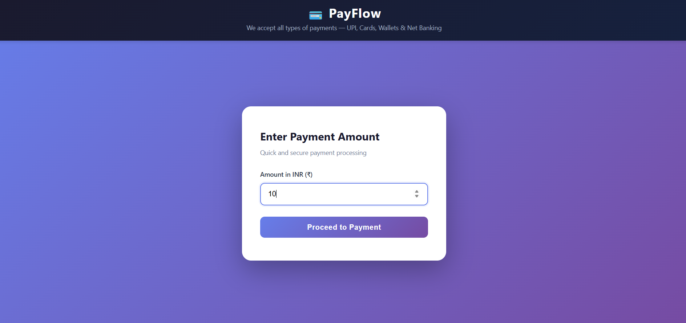
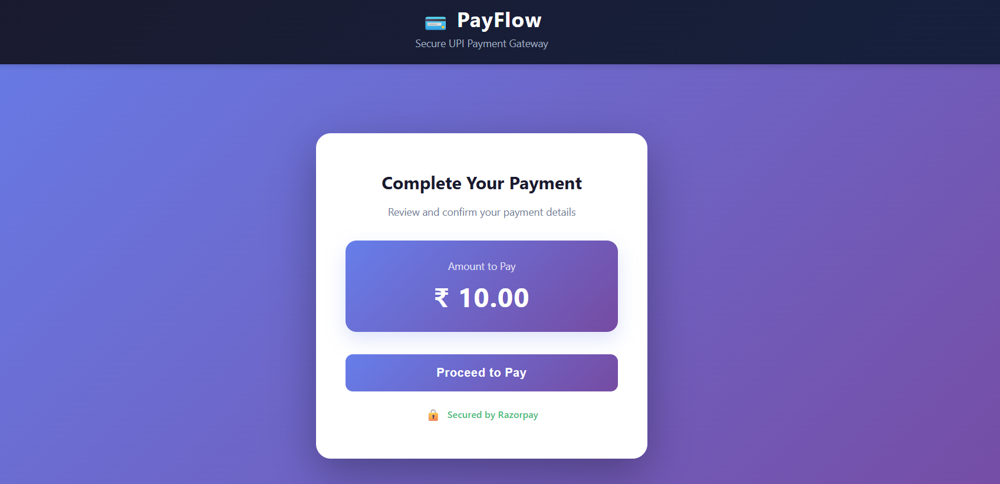
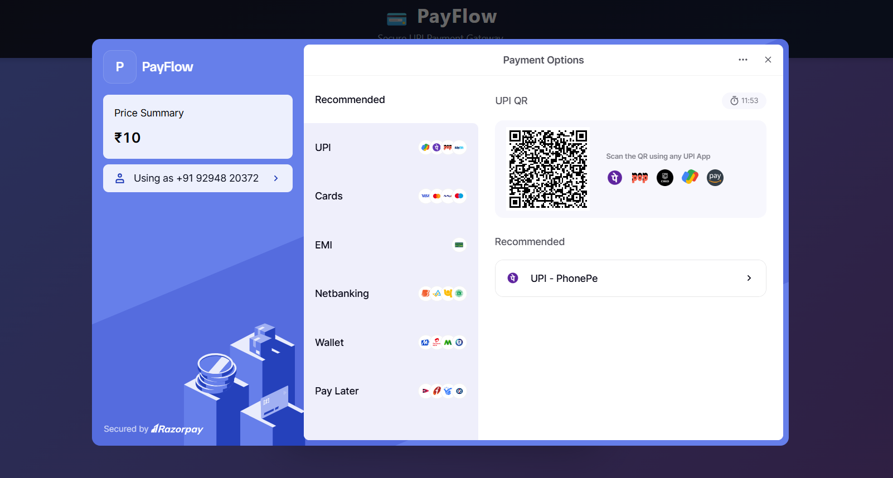
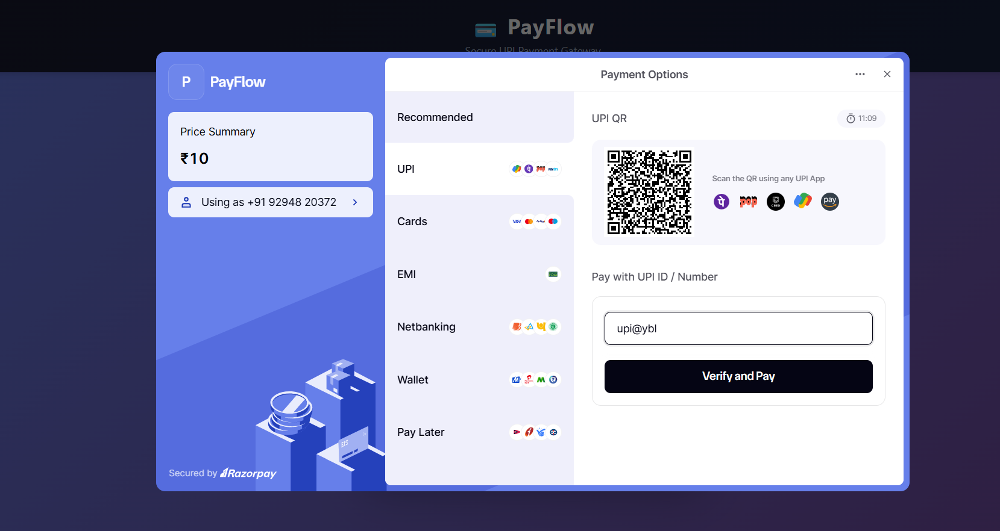
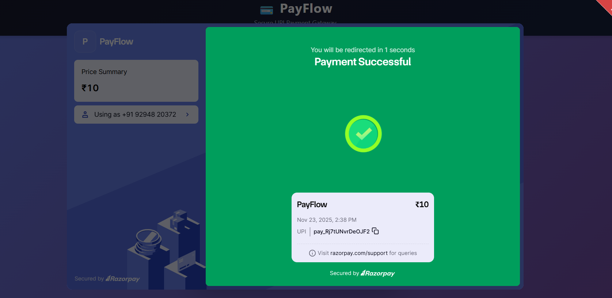
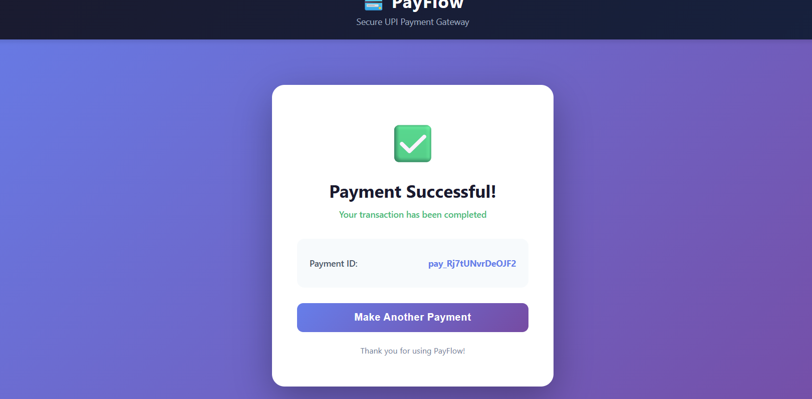

# Unified Payments Gateway (UPI Payment UI)

A modern, user-friendly unified payment gateway built with Flask and Razorpay integration. This application provides a seamless UPI payment experience with multiple payment options and beautiful UI.

## 🎯 Project Overview

The Unified Payments Gateway is a Flask-based web application that integrates with Razorpay to process payments securely. It provides an intuitive interface for users to select payment amounts and complete transactions through UPI, debit cards, and other payment methods supported by Razorpay.

## ✨ Features

- **Modern UI Design** - Clean, responsive payment interface with gradient backgrounds
- **UPI Payment Support** - Integrated Razorpay payment gateway
- **Multiple Payment Options** - Support for UPI, debit cards, credit cards, and more
- **Amount Selection** - Easy-to-use amount input with predefined quick options
- **Payment Confirmation** - Real-time payment status and confirmation page
- **Security** - Secured by Razorpay with industry-standard encryption
- **Responsive Design** - Works seamlessly on desktop, tablet, and mobile devices
- **Payment History** - Track and store payment details

## 📁 Project Structure

\`\`\`
unified-payments-gateway/
├── app.py                    # Flask backend application
├── requirements.txt          # Python dependencies
├── test-config.py           # Configuration testing
├── .gitignore               # Git ignore file
│
├── templates/               # HTML templates
│   ├── index.html          # Home page with amount selection
│   ├── payment.html        # Payment processing page
│   └── success.html        # Payment confirmation page
│
├── static/                  # Static files (CSS, JS)
│   └── [stylesheets & scripts]
│
├── payment_detail/          # Payment records storage
│   └── [payment history]
│
└── images/                  # Screenshots
    ├── Screenshot-1.png
    ├── Screenshot-2.png
    ├── Screenshot-3.png
    ├── Screenshot-4.png
    ├── Screenshot-5.png
    └── Screenshot-6.png
\`\`\`

## 📸 Screenshots

### Screenshot 1 - Home Page / Amount Selection

The landing page where users can enter or select the payment amount they want to transfer.

### Screenshot 2 - Payment Options

Display of predefined payment amount options for quick selection.

### Screenshot 3 - Payment Gateway Integration

Razorpay payment gateway integration interface with payment method selection.

### Screenshot 4 - UPI Payment Interface

UPI-specific payment interface showing payment details and confirmation options.

### Screenshot 5 - Payment Processing

Payment processing status and transaction details during payment confirmation.

### Screenshot 6 - Success Page

Confirmation page displaying successful payment completion with transaction details.

## 🛠️ Tech Stack

- **Backend**: Flask (Python)
- **Payment Gateway**: Razorpay
- **Frontend**: HTML5, CSS3, JavaScript
- **Database**: Payment detail storage system
- **Security**: Razorpay's secure payment processing

## 📦 Dependencies

- Flask - Web framework
- Razorpay Python SDK - Payment gateway integration
- Additional Python packages (see requirements.txt)

## 🚀 Installation & Setup

### Prerequisites
- Python 3.x
- Razorpay account with API keys
- pip (Python package manager)

### Steps

1. **Clone/Download the project**
   \`\`\`bash
   cd unified-payments-gateway
   \`\`\`

2. **Install dependencies**
   \`\`\`bash
   pip install -r requirements.txt
   \`\`\`

3. **Configure Razorpay API Keys**
   - Open `test-config.py` and add your Razorpay API keys:
   \`\`\`python
   RAZORPAY_KEY_ID = "your_key_id"
   RAZORPAY_KEY_SECRET = "your_key_secret"
   \`\`\`

4. **Run the Flask application**
   \`\`\`bash
   python app.py
   \`\`\`

5. **Access the application**
   - Open your browser and navigate to `http://localhost:5000`

## 💳 How to Use

1. **Enter Payment Amount**
   - Navigate to the home page
   - Enter the desired payment amount or select from quick options
   - The amount should be displayed correctly without unwanted multiplication

2. **Proceed to Payment**
   - Click the "Proceed to Pay" button
   - You'll be redirected to the Razorpay payment gateway

3. **Select Payment Method**
   - Choose your preferred payment method (UPI, Card, etc.)
   - Enter payment details as required

4. **Complete Payment**
   - Verify transaction details
   - Confirm the payment
   - Complete OTP/verification if required

5. **Payment Confirmation**
   - View the success page with transaction details
   - Payment history is automatically saved

## 🔒 Security Features

- **Razorpay Integration**: Industry-standard encryption and PCI compliance
- **Secure Communication**: HTTPS support ready
- **Transaction Validation**: Server-side verification of payments
- **Payment Storage**: Secure local storage in `payment_detail` directory

## 📝 Key Pages

| Page | Purpose | Route |
|------|---------|-------|
| index.html | Amount selection and home | `/` |
| payment.html | Payment processing interface | `/pay` |
| success.html | Transaction confirmation | `/success` |

## 🐛 Troubleshooting

### Amount Display Issue
- Fixed: Amount now displays correctly as ₹X.XX format
- The amount in Razorpay is stored in paise (100 paise = 1 INR)
- Frontend converts paise to INR for display: `amount ÷ 100 = INR amount`

### Payment Not Processing
- Verify Razorpay API keys are correctly configured
- Check internet connection
- Ensure payment details are correctly filled

### CORS Issues
- Configure Flask CORS settings if calling from different domains
- Update allowed origins in app.py

## 📄 Configuration Files

### requirements.txt
Contains all Python package dependencies needed for the project.

### test-config.py
Test configuration file for Razorpay API keys and other settings.

### .gitignore
Standard git ignore file to exclude sensitive files and directories.

## 🔄 Payment Flow

\`\`\`
User Enters Amount
    ↓
Amount Validation
    ↓
Payment Page Load with Razorpay Integration
    ↓
User Selects Payment Method
    ↓
Payment Processing (Razorpay Handles)
    ↓
Payment Success/Failure
    ↓
Success/Confirmation Page
    ↓
Payment Details Stored
\`\`\`

## 📊 Payment Detail Storage

All completed transactions are stored in the `payment_detail/` directory for record-keeping and audit purposes.

## 🎨 UI/UX Highlights

- **Modern Design**: Gradient backgrounds and smooth animations
- **User-Friendly**: Intuitive navigation and clear instructions
- **Responsive Layout**: Adapts to all screen sizes
- **Real-time Feedback**: Immediate validation and status updates
- **Professional Appearance**: Modern card-based design with proper spacing

## 🤝 Integration with Razorpay

This application uses Razorpay's payment gateway API for:
- Secure payment processing
- Multiple payment method support
- Real-time transaction status
- Automatic settlement
- Transaction reporting

## 📱 Mobile Support

The application is fully responsive and works on:
- Desktop browsers
- Tablets
- Mobile phones (iOS & Android)

## ✅ Quality Assurance

- Amount displays correctly (no unwanted multiplication)
- Payment gateway integration tested
- Responsive design verified across devices
- Transaction confirmation working properly

## 📞 Support

For issues or questions:
1. Check the troubleshooting section
2. Verify Razorpay API configuration
3. Review Flask logs for detailed error messages
4. Contact Razorpay support for payment-related issues

## 📄 License

This project is built for educational and commercial payment processing purposes.

---

**Last Updated**: November 23, 2025

**Version**: 1.0.0

**Status**: ✅ Active & Maintained
